# Building and Publishing a Multi-Targeted VSIX

This guide walks through updating a Visual Studio extension (VSIX) to single payload to
multiple payload, that targets both Visual Studio 2022 (17.x) and Visual Studio 2026 (18.x),
publishing it to the marketplace.

---

## Prerequisites

- Visual Studio 2026 18.5 or later for building a multi-targeted extension.
- Visual Studio 2026 18.8 Insiders or later for testing the new Marketplace features.
- Access to the pre-production environment (PPE) internal marketplace at <https://marketplace.vsallin.net/>.

---

## Background (optional steps)

This walkthrough assumes owning an existing extension that targets Visual Studio 2022 (17.0).
The following paragraphs set that up.

### Step 1 — Create a new VSIX project with the traditional tooling

1. In Visual Studio, choose **File → New → Project**.
2. Search for **VSIX** in the template search box.
3. Select **VSIX Project** (C#) and click **Next**.
4. Give the project a name (this guide uses **`Foo`**) and create it.

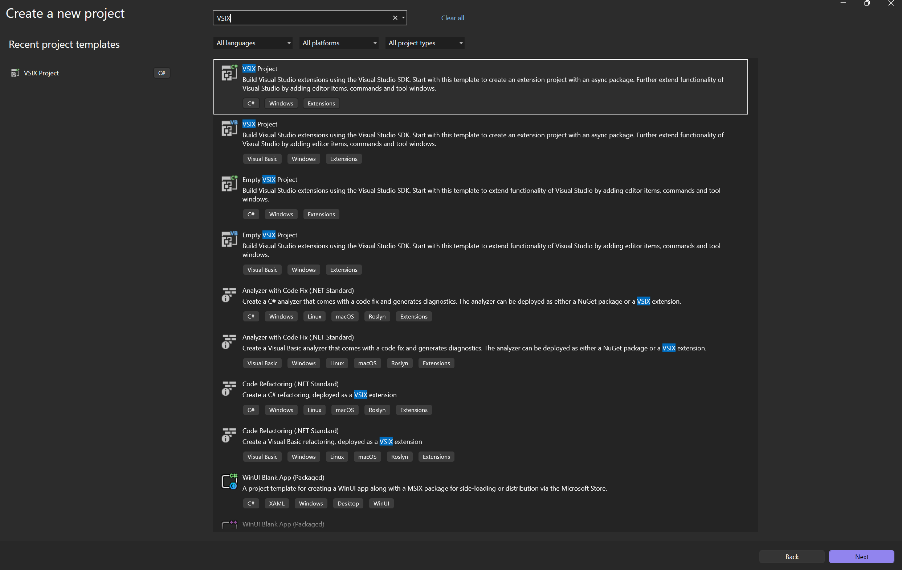

> **NOTE**
> The **VSIX Project** template scaffolds an extension with an async package. The **Empty VSIX Project** template is also fine if you prefer to add the command files yourself.

---

### Step 2 — Set the installation targets (v1)

1. Open the `source.extension.vsixmanifest`
2. Update the installation targets to be `[17.0,18.0)`

> **NOTE**:
> For the purposes of this demo we set targets to `[17.0, 18.0)` and use the older package references. This is no longer best practice (since Dev 17 is Evergreen) but we do it to accurately reflect a realistic scenario.

```xml
<?xml version="1.0" encoding="utf-8"?>
<PackageManifest Version="2.0.0" xmlns="http://schemas.microsoft.com/developer/vsx-schema/2011" xmlns:d="http://schemas.microsoft.com/developer/vsx-schema-design/2011">
  <Metadata>
    <Identity Id="{YOUR VSIX ID}" Version="1.0" Language="en-US" Publisher="{YOUR PUBLISHER NAME}" />
    <DisplayName>Foo</DisplayName>
    <Description>Empty VSIX Project.</Description>
  </Metadata>
  <Installation>
    <InstallationTarget Id="Microsoft.VisualStudio.Community" Version="[17.0, 18.0)">
      <ProductArchitecture>amd64</ProductArchitecture>
    </InstallationTarget>
  </Installation>
  <Dependencies>
    <Dependency Id="Microsoft.Framework.NDP" DisplayName="Microsoft .NET Framework" Version="[4.5,)" d:Source="Manual" />
  </Dependencies>
  <Prerequisites>
    <Prerequisite Id="Microsoft.VisualStudio.Component.CoreEditor" DisplayName="Visual Studio core editor" Version="[17.0, )" />
  </Prerequisites>
  <Assets>
    <Asset Type="Microsoft.VisualStudio.VsPackage" Path="|%CurrentProject%;PkgdefProjectOutputGroup|" d:Source="Project" d:ProjectName="%CurrentProject%" />
  </Assets>
</PackageManifest>
```

---

### Step 3 — Add the command files to the project

Use the command template to add a command to your extension.

1. Right-click your project and choose **Add → New Item**.
2. Under the **Extensibility** templates click **Command**.
3. Give the command a name and click **Next**.

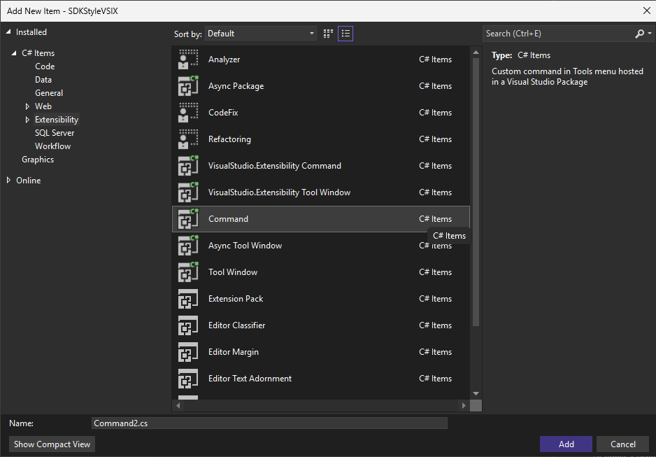

---

### Step 4 — Build and upload the VSIX (v1) to the marketplace

1. Build the project to produce `Foo.vsix`.
2. Go to <https://marketplace.vsallin.net/> and publish the VSIX under your publisher account.

> **NOTE**:
> The URI https://marketplace.vsallin.net/ is the marketplace pre-production environment (PPE).

After uploading, the **Manage** page shows **Version 1.0** with a single payload targeting **API Version
17.0**, **amd64**, **Community**:

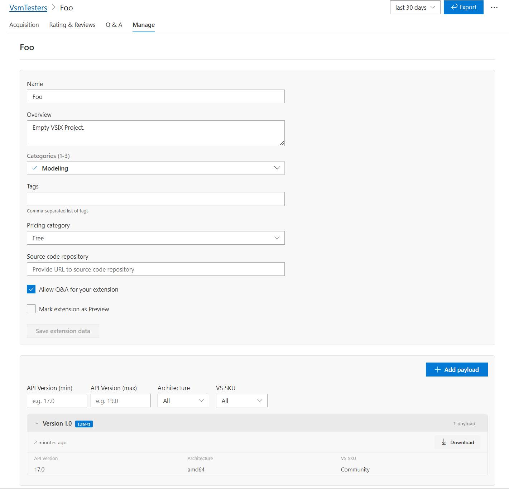

---

## Walkthrough

### Step 1 — Update the csproj and installation targets (v2)

> **NOTE:**
> For background on the new SDK style projects for VSIXs, please see: https://devblogs.microsoft.com/visualstudio/sdk-style-support-for-extension-projects/. To get access to these features, you must use `Microsoft.VSSDK.BuildTools` version `18.5.40034` or newer.
>
> This version of `Microsoft.VSSDK.BuildTools` is not yet available on nuget.org. To restore it, add the following NuGet package source:
>
> ```text
> https://pkgs.dev.azure.com/azure-public/vside/_packaging/vssdk/nuget/v3/index.json
> ```
>
> You can configure this feed in a `NuGet.config` file, for example:
>
> ```xml
> <?xml version="1.0" encoding="utf-8"?>
> <configuration>
>   <packageSources>
>     <add key="vssdk" value="https://pkgs.dev.azure.com/azure-public/vside/_packaging/vssdk/nuget/v3/index.json" />
>   </packageSources>
> </configuration>
> ```

To support multiple Visual Studio versions and architectures from one source, switch to the
multi-targeting **`Microsoft.VisualStudio.Sdk.Build`** SDK and let the manifest derive its installation target version from the build.

### Updated `.csproj` (multi-targeting SDK)

```xml
<Project Sdk="Microsoft.VisualStudio.Sdk.Build">
	<PropertyGroup>
		<TargetFrameworks>vs2022;vs2026_5</TargetFrameworks>
		<ExtensionType>VSSDK</ExtensionType>
		<Nullable>enable</Nullable>
		<LangVersion>latest</LangVersion>
	</PropertyGroup>
</Project>
```

That's all you need! The new format is much simpler and more compact.

> `TargetFrameworks` now lists `vs2022` and `vs2026_5`, so a separate payload is produced for each
> Visual Studio generation. This is also what enables the `VS_180_OR_GREATER` define used in
> `HelloCommand.cs`.

### Updated `source.extension.vsixmanifest`

Bump the version to **2.0**, mark the installation as `ExtensionType="VSSDK"`, and let the target
version be computed per build with `GetInstallationTargetVersion`:

```xml
<?xml version="1.0" encoding="utf-8"?>
<PackageManifest Version="2.0.0" xmlns="http://schemas.microsoft.com/developer/vsx-schema/2011" xmlns:d="http://schemas.microsoft.com/developer/vsx-schema-design/2011">
  <Metadata>
    <Identity Id="Foo.ff3c0a49-d688-40ff-bac6-fd24de1aa3ed" Version="2.0" Language="en-US" Publisher="VsmTesters" />
    <DisplayName>Foo</DisplayName>
    <Description>Empty VSIX Project.</Description>
  </Metadata>
	<Installation ExtensionType="VSSDK">
		<InstallationTarget Id="Microsoft.VisualStudio.Community" Version="|%CurrentProject%;GetInstallationTargetVersion|" />
	</Installation>
  <Dependencies>
    <Dependency Id="Microsoft.Framework.NDP" DisplayName="Microsoft .NET Framework" Version="[4.5,)" d:Source="Manual" />
  </Dependencies>
  <Prerequisites>
    <Prerequisite Id="Microsoft.VisualStudio.Component.CoreEditor" DisplayName="Visual Studio core editor" Version="[17.0, )" />
  </Prerequisites>
  <Assets>
    <Asset Type="Microsoft.VisualStudio.VsPackage" Path="|%CurrentProject%;PkgdefProjectOutputGroup|" d:Source="Project" d:ProjectName="%CurrentProject%" />
  </Assets>
</PackageManifest>
```

### Multi-targeting SDK template

To create new extensions using the new SDK template, enable support for the SDK template in your VS settings and create the new extension. The feature can be enabled under **Preview Features**.

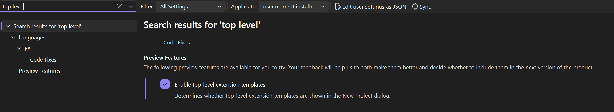

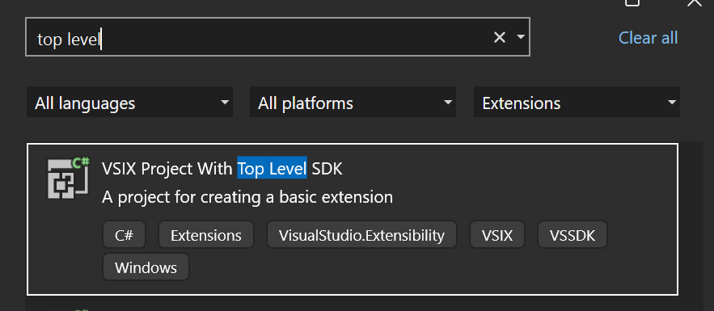

---

### Step 2 - Conditional compilation

Update the command execution by adding conditional compilation wth `VS_180_OR_GREATER` to change your extension behavior based on the Visual Studio client version.

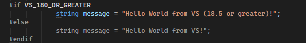

### Step 3 — Build and publish the two VSIXs (v2)

Building the multi-targeted project now produces **two** VSIX payloads — one for each target framework. Upload each one to the same **Foo** extension as separate payloads.

#### Uploading a payload

Use **Add payload**, then drop or browse to the built `.vsix` (for example `Foo_18.5_v2.vsix`):

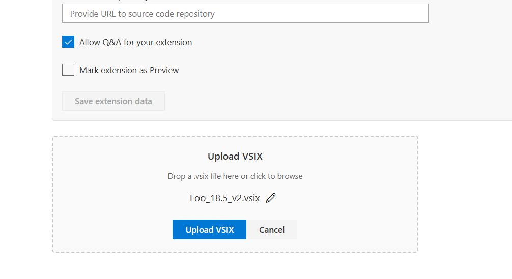

#### The 17.14 payload

The marketplace extracts read-only metadata from the VSIX. The VS 2022 payload targets API version
**[17.14, 19.0)** for both **amd64** and **arm64**:

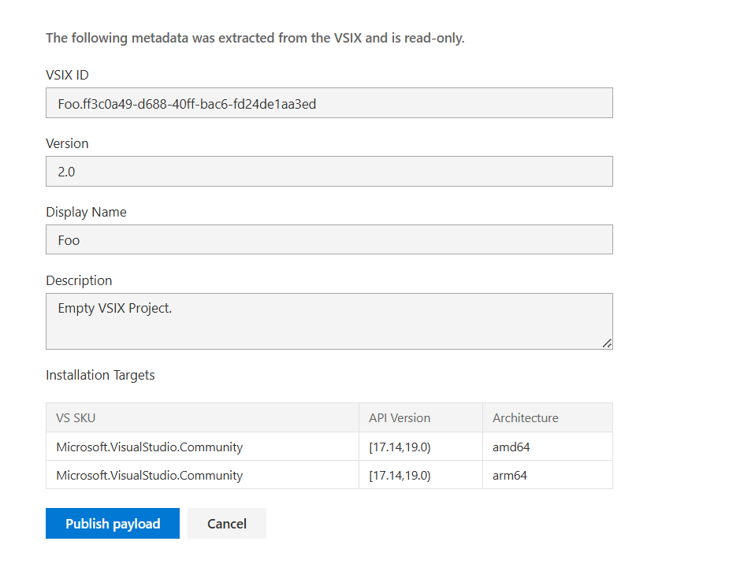

#### The 18.5 payload

The VS 2026 payload targets API version **[18.5, )** for both **amd64** and **arm64**:

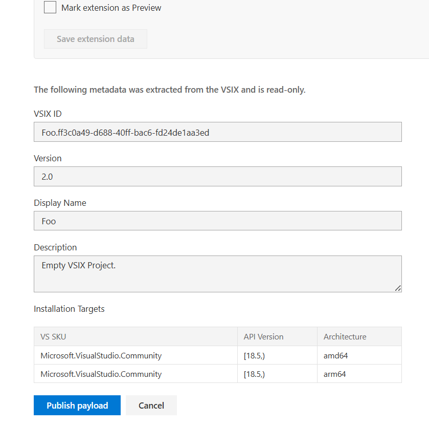

Click **Publish payload** for each. The extension now has Version 2.0 with multiple payloads covering
17.14+ and 18.5+ across amd64 and arm64.

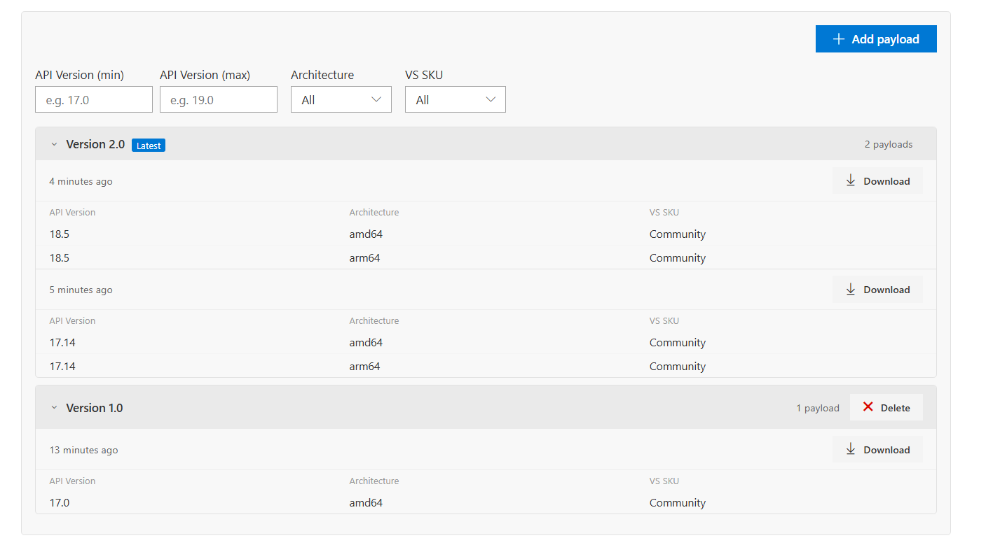

---

### Step 4 — Enable multiple payloads on Visual Studio 18 (one-time test setup)

Visual Studio 2026 18.8 Insiders needs a feature flag to consume the multi-payload (MPPE) marketplace endpoint.

1. Find the **instance ID** of your VS 18 installation by listing:

   ```text
   %localappdata%\Microsoft\VisualStudio\18.*
   ```

   You'll see a folder like `18.0_a1b2c3d4` — the part after `18.0_` (here `a1b2c3d4`) is the instance ID.

2. Set the following registry key (replace `{ID}` with the instance ID from above) to enable the MPPE
   endpoint:

   ```text
   HKCU\Software\Microsoft\VisualStudio\18.0_{ID}\FeatureFlags\ExtensionManager\UseMppeEndpoint
   ```

   Set it to a `DWORD` value of `1`.

   PowerShell example:

   ```powershell
   $id = (Get-ChildItem "$env:LOCALAPPDATA\Microsoft\VisualStudio\18.*" -Directory |
          Select-Object -First 1).Name.Split('_')[-1]
   $key = "HKCU:\Software\Microsoft\VisualStudio\18.0_$id\FeatureFlags\ExtensionManager"
   New-Item -Path $key -Force | Out-Null
   New-ItemProperty -Path $key -Name "UseMppeEndpoint" -Value 1 -PropertyType DWord -Force
   ```

3. Restart Visual Studio 2026 for the flag to take effect.

---

### Step 5 — Point Visual Studio at the PPE marketplace

The feature flag tells VS to use the MPPE endpoint, but VS still needs to know **which** marketplace to
talk to. Point it at the PPE environment by setting an environment variable:

1. Open **Edit the system environment variables → Environment Variables → New** (a system or user
   variable both work).
2. Add a variable named **`UseTestMarketplaceUri`** with the value **`https://marketplace.vsallin.net`**.

   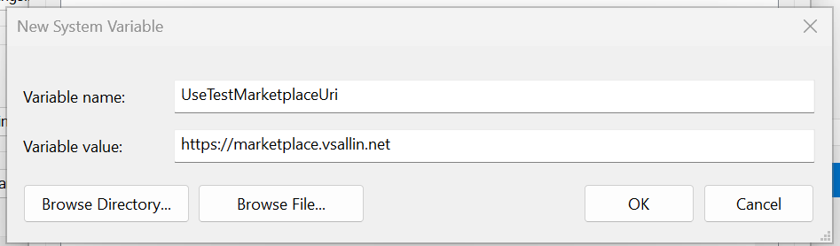

   PowerShell example (user-scoped):

   ```powershell
   [Environment]::SetEnvironmentVariable("UseTestMarketplaceUri", "https://marketplace.vsallin.net", "User")
   ```

3. Restart Visual Studio so it picks up the new environment variable.

---

### Step 6 — Verify version-specific results across VS versions

Search for the **Foo** extension in **Extensions → Manage Extensions** on different Visual Studio
versions. Because the marketplace serves the payload whose installation target matches the running IDE, each version resolves to a different payload:

| Visual Studio version | Resolved payload | API Version target |
| --------------------- | ---------------- | ------------------ |
| VS 17.14              | v2 (17.14)       | `[17.14, 19.0)`    |
| VS 18.x               | v2 (18.5)        | `[18.5, )`         |
| VS 17.12              | v1 (17.0)        | `[17.0, )`         |

- **VS 17.14** picks up the newer 17.14 payload (Foo **2.0**).

  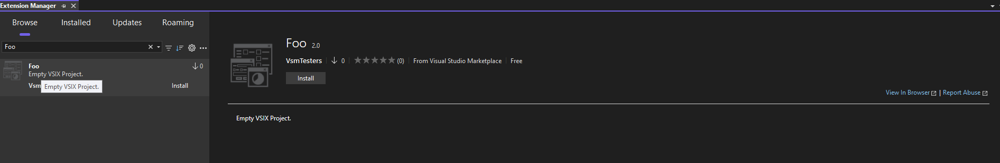

- **VS 18.x** (with the feature flag from Step 9) picks up the 18.5 payload (Foo **2.0**) — and the
  message box should specify VS 2026 or later due to the `VS_180_OR_GREATER` define.

  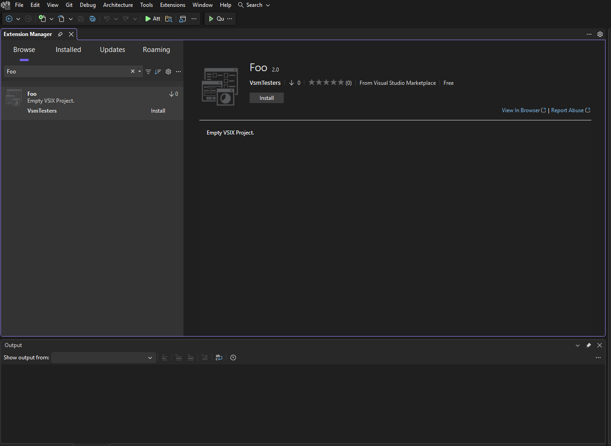

- **VS 17.12** falls back to the original v1 payload (Foo **1.0**), since it's below the 17.14 floor of
  the v2 payload.

  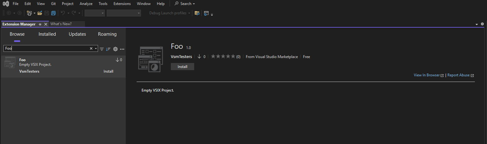

---

## A comment on best practices for payload versioning

Always have the **latest version** of your extension support the **latest Visual Studio version** (API
version), and optionally support any number of older Visual Studio versions through additional
payloads. Following this practice ensures that VS 18.9+ (with the feature flag enabled) and earlier
versions of Visual Studio resolve payloads in the same coherent way.

If you don't follow this practice, payload selection diverges between Visual Studio generations:

- **VS 18.9+** (with the feature flag enabled) selects the payload that supports the **highest** VS
  version, favoring the highest extension version to break ties.
- **Earlier VS versions** select the payload with the **highest version number that still supports
  that VS version**.

Keeping your newest extension version aligned with the newest VS version avoids this divergence and
gives every client a predictable result.